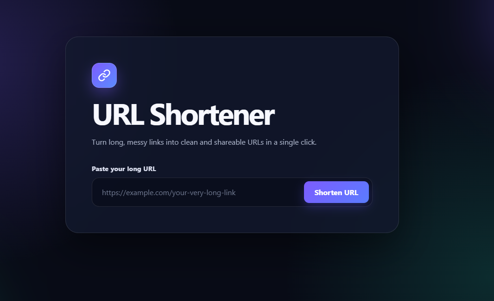
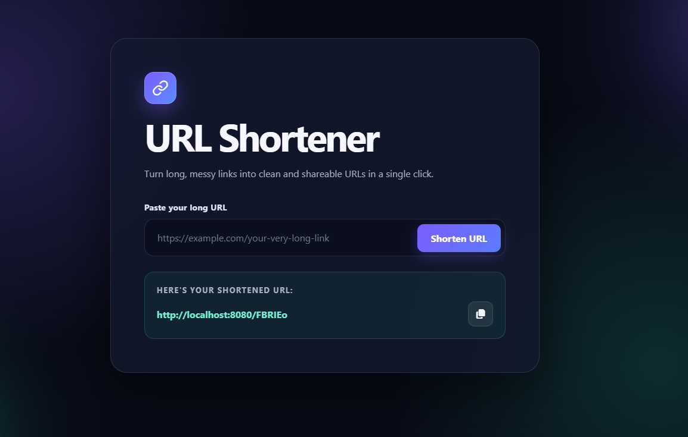

# URL Shortener

A responsive URL-shortening application built with **CodeIgniter 4**, **PHP**, and **MySQL**. Paste a long URL, generate a six-character short code, copy the shortened link, and use it to redirect to the original address.

## Project preview

### Before shortening a URL



### After shortening a URL



## Features

- Generates a random six-character code for each submitted URL
- Stores the original URL and short code in MySQL
- Redirects short links to their original destinations
- Marks a link as opened after it is visited
- Copies generated links to the clipboard
- Includes client-side required-field validation
- Provides a responsive glassmorphism-style interface

## Technology stack

| Technology | Purpose |
| --- | --- |
| PHP 8.2+ | Server-side language |
| CodeIgniter 4.7 | MVC framework, routing, database access, and migrations |
| MySQL / MySQLi | URL storage |
| HTML and CSS | Page structure and responsive design |
| jQuery + jQuery Validate | Client-side interaction and validation |
| Toastr | Copy-success notification |
| Font Awesome | Copy icon |

## Requirements

- PHP **8.2 or newer**
- [Composer](https://getcomposer.org/)
- MySQL or MariaDB
- PHP extensions: `intl`, `mbstring`, and `mysqli`

Check the installed tools with:

```bash
php --version
composer --version
mysql --version
```

## Installation and run process

### 1. Clone the repository

```bash
git clone <repository-url>
cd url-shortener
```

If the project is already downloaded, open a terminal in its root directory.

### 2. Install dependencies

```bash
composer install
```

### 3. Create the environment file

If the CodeIgniter `env` template is present, copy it to `.env`:

Windows PowerShell:

```powershell
Copy-Item env .env
```

Linux or macOS:

```bash
cp env .env
```

If there is no template, create a plain-text file named `.env` in the project root. Set the development environment and local URL:

```ini
CI_ENVIRONMENT = development
app.baseURL = 'http://localhost:8080/'
```

### 4. Create the database

Run this statement using MySQL, phpMyAdmin, MySQL Workbench, or another database client:

```sql
CREATE DATABASE ci4_url_shortener
    CHARACTER SET utf8mb4
    COLLATE utf8mb4_general_ci;
```

### 5. Configure the database

Update `.env` to match your MySQL installation:

```ini
database.default.hostname = localhost
database.default.database = ci4_url_shortener
database.default.username = root
database.default.password = ''
database.default.DBDriver = MySQLi
database.default.DBPrefix =
database.default.port = 3306
```

Use your actual username and password. Do not commit an `.env` file containing real credentials.

### 6. Create the `urls` table

Run the included migration:

```bash
php spark migrate
```

The migration creates:

| Field | Description |
| --- | --- |
| `id` | Auto-incrementing primary key |
| `long_url` | Original destination URL |
| `shortcode` | Generated short code |
| `is_opened` | Changes from `0` to `1` when visited |
| `created_at` | Record creation time |

Check migration status with:

```bash
php spark migrate:status
```

### 7. Start the application

```bash
php spark serve
```

Open:

```text
http://localhost:8080/url-shortener
```

Keep the terminal running while using the app. Press `Ctrl+C` to stop the server.

## How to use it

1. Open `http://localhost:8080/url-shortener`.
2. Paste a complete destination URL, including `http://` or `https://`.
3. Select **Shorten URL**.
4. Copy the generated link with the copy button.
5. Open or share it. Visiting the short link redirects to the saved destination.

Example:

```text
Long URL:  https://example.com/a/very/long/path
Short URL: http://localhost:8080/aB3xY9
```

## How the project was created

The application follows CodeIgniter's MVC structure.

### 1. CodeIgniter setup

The initial application can be created with:

```bash
composer create-project codeigniter4/appstarter url-shortener
cd url-shortener
```

### 2. Database migration

`app/Database/Migrations/2026-09-03-103655_CreateUrlsTable.php` defines the `urls` table. A migration skeleton can be generated with:

```bash
php spark make:migration CreateUrlsTable
```

After its fields are defined, `php spark migrate` applies it.

### 3. Controller logic

`app/Controllers/URLController.php` contains the core logic:

- `urlShortener()` displays the form and handles submissions.
- `getURLShortCode()` shuffles letters and numbers and returns six characters.
- `handelShortURLs()` finds a code, marks it as opened, and redirects.

A controller skeleton can be generated with:

```bash
php spark make:controller URLController
```

### 4. Routes

`app/Config/Routes.php` connects requests to the controller:

```php
$routes->match(['get', 'post'], 'url-shortener', 'URLController::urlShortener');
$routes->get('(:segment)', 'URLController::handelShortURLs/$1');
```

The first route displays and submits the form. The dynamic route treats one URL segment as a possible short code.

### 5. Interface

- `app/Views/url-shortener.php` contains the form, result panel, copy action, and validation.
- `public/style.css` contains the layout, responsive rules, colors, and visual effects.
- CDN resources provide jQuery, jQuery Validate, Toastr, and Font Awesome.

## Request flow

```text
Submit long URL
      |
      v
Generate a six-character code
      |
      v
Save original URL + code in MySQL
      |
      v
Display the short URL
      |
      v
Visitor opens /{shortcode}
      |
      v
Database lookup -> mark as opened -> redirect
```

If a code is not found, the application returns a JSON error response.

## Project structure

```text
url-shortener/
|-- app/
|   |-- Config/Routes.php
|   |-- Controllers/URLController.php
|   |-- Database/Migrations/2026-09-03-103655_CreateUrlsTable.php
|   `-- Views/url-shortener.php
|-- public/
|   |-- index.php
|   `-- style.css
|-- writable/
|-- .env
|-- composer.json
|-- Shorten-URL.png
|-- Without-Shorten.png
|-- spark
`-- README.md
```

## Useful commands

```bash
# Start the development server
php spark serve

# Apply pending migrations
php spark migrate

# Show migration status
php spark migrate:status

# Roll back the latest migration batch
php spark migrate:rollback

# Run the test suite
composer test
```

## Troubleshooting

### Database connection error

- Confirm MySQL is running.
- Check the database name, credentials, host, and port in `.env`.
- Ensure the `mysqli` extension is enabled.

### `urls` table not found

Run `php spark migrate`.

### Page not found

Use `http://localhost:8080/url-shortener`, not only the root URL. With Apache or Nginx, point the document root to the project's `public` directory.

### Wrong styles or generated URL

Ensure `.env` uses the same URL and port as the server:

```ini
app.baseURL = 'http://localhost:8080/'
```

### Writable-directory error

Ensure the web-server user has write access to `writable`.

## Production notes

Before public deployment:

- Set `CI_ENVIRONMENT = production`.
- Point the web-server document root to `public/`.
- Use HTTPS and set `app.baseURL` to the production domain.
- Keep `.env`, credentials, and application code outside the public document root.
- Add strict URL validation and allowed-scheme checking.
- Enforce unique short codes and regenerate a code after a collision.
- Add rate limiting and abuse protection.

## License

This project is available under the [MIT License](LICENSE).
