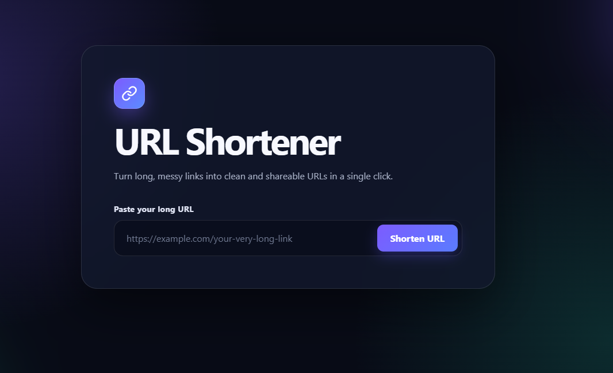
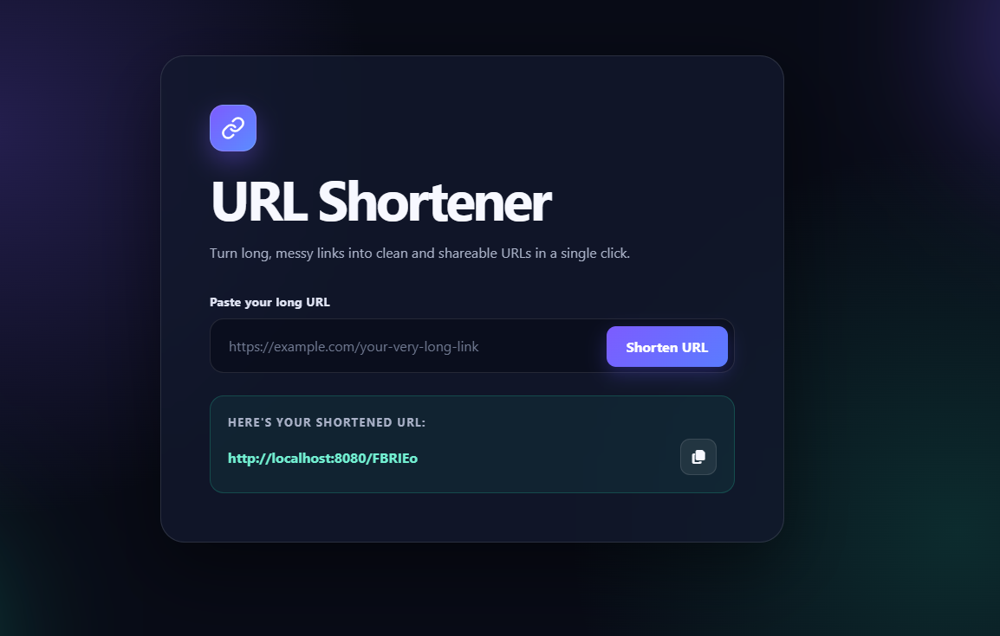

# URL Shortener

A responsive URL-shortening application built with **CodeIgniter 4**, **PHP**, and **MySQL**. Paste a long URL, generate a six-character short code, copy the shortened link, and use it to redirect to the original address.

## Project preview

### Before shortening a URL



### After shortening a URL



## Features

- Generates a random six-character code for each submitted URL
- Stores the original URL and short code in MySQL
- Redirects short links to their original destinations
- Marks a link as opened after it is visited
- Copies generated links to the clipboard
- Includes client-side required-field validation
- Provides a responsive glassmorphism-style interface

## Technology stack

| Technology | Purpose |
| --- | --- |
| PHP 8.2+ | Server-side language |
| CodeIgniter 4.7 | MVC framework, routing, database access, and migrations |
| MySQL / MySQLi | URL storage |
| HTML and CSS | Page structure and responsive design |
| jQuery + jQuery Validate | Client-side interaction and validation |
| Toastr | Copy-success notification |
| Font Awesome | Copy icon |

## Requirements

- PHP **8.2 or newer**
- [Composer](https://getcomposer.org/)
- MySQL or MariaDB
- PHP extensions: `intl`, `mbstring`, and `mysqli`

Check the installed tools with:

```bash
php --version
composer --version
mysql --version
```

## Installation and run process

### 1. Clone the repository

```bash
git clone <repository-url>
cd url-shortener
```

If the project is already downloaded, open a terminal in its root directory.

### 2. Install dependencies

```bash
composer install
```

### 3. Create the environment file

If the CodeIgniter `env` template is present, copy it to `.env`:

Windows PowerShell:

```powershell
Copy-Item env .env
```

Linux or macOS:

```bash
cp env .env
```

If there is no template, create a plain-text file named `.env` in the project root. Set the development environment and local URL:

```ini
CI_ENVIRONMENT = development
app.baseURL = 'http://localhost:8080/'
```

### 4. Create the database

Run this statement using MySQL, phpMyAdmin, MySQL Workbench, or another database client:

```sql
CREATE DATABASE ci4_url_shortener
    CHARACTER SET utf8mb4
    COLLATE utf8mb4_general_ci;
```

### 5. Configure the database

Update `.env` to match your MySQL installation:

```ini
database.default.hostname = localhost
database.default.database = ci4_url_shortener
database.default.username = root
database.default.password = ''
database.default.DBDriver = MySQLi
database.default.DBPrefix =
database.default.port = 3306
```

Use your actual username and password. Do not commit an `.env` file containing real credentials.

### 6. Create the `urls` table

Run the included migration:

```bash
php spark migrate
```

The migration creates:

| Field | Description |
| --- | --- |
| `id` | Auto-incrementing primary key |
| `long_url` | Original destination URL |
| `shortcode` | Generated short code |
| `is_opened` | Changes from `0` to `1` when visited |
| `created_at` | Record creation time |

Check migration status with:

```bash
php spark migrate:status
```

### 7. Start the application

```bash
php spark serve
```

Open:

```text
http://localhost:8080/url-shortener
```

Keep the terminal running while using the app. Press `Ctrl+C` to stop the server.

## How to use it

1. Open `http://localhost:8080/url-shortener`.
2. Paste a complete destination URL, including `http://` or `https://`.
3. Select **Shorten URL**.
4. Copy the generated link with the copy button.
5. Open or share it. Visiting the short link redirects to the saved destination.

Example:

```text
Long URL:  https://example.com/a/very/long/path
Short URL: http://localhost:8080/aB3xY9
```

## How the project was created

The application follows CodeIgniter's MVC structure.

### 1. CodeIgniter setup

The initial application can be created with:

```bash
composer create-project codeigniter4/appstarter url-shortener
cd url-shortener
```

### 2. Database migration

`app/Database/Migrations/2026-09-03-103655_CreateUrlsTable.php` defines the `urls` table. A migration skeleton can be generated with:

```bash
php spark make:migration CreateUrlsTable
```

After its fields are defined, `php spark migrate` applies it.

### 3. Controller logic

`app/Controllers/URLController.php` contains the core logic:

- `urlShortener()` displays the form and handles submissions.
- `getURLShortCode()` shuffles letters and numbers and returns six characters.
- `handelShortURLs()` finds a code, marks it as opened, and redirects.

A controller skeleton can be generated with:

```bash
php spark make:controller URLController
```

### 4. Routes

`app/Config/Routes.php` connects requests to the controller:

```php
$routes->match(['get', 'post'], 'url-shortener', 'URLController::urlShortener');
$routes->get('(:segment)', 'URLController::handelShortURLs/$1');
```

The first route displays and submits the form. The dynamic route treats one URL segment as a possible short code.

### 5. Interface

- `app/Views/url-shortener.php` contains the form, result panel, copy action, and validation.
- `public/style.css` contains the layout, responsive rules, colors, and visual effects.
- CDN resources provide jQuery, jQuery Validate, Toastr, and Font Awesome.

## Request flow

```text
Submit long URL
      |
      v
Generate a six-character code
      |
      v
Save original URL + code in MySQL
      |
      v
Display the short URL
      |
      v
Visitor opens /{shortcode}
      |
      v
Database lookup -> mark as opened -> redirect
```

If a code is not found, the application returns a JSON error response.

## Project structure

```text
url-shortener/
|-- app/
|   |-- Config/Routes.php
|   |-- Controllers/URLController.php
|   |-- Database/Migrations/2026-09-03-103655_CreateUrlsTable.php
|   `-- Views/url-shortener.php
|-- public/
|   |-- index.php
|   `-- style.css
|-- writable/
|-- .env
|-- composer.json
|-- Shorten-URL.png
|-- Without-Shorten.png
|-- spark
`-- README.md
```

## Useful commands

```bash
# Start the development server
php spark serve

# Apply pending migrations
php spark migrate

# Show migration status
php spark migrate:status

# Roll back the latest migration batch
php spark migrate:rollback

# Run the test suite
composer test
```

## Troubleshooting

### Database connection error

- Confirm MySQL is running.
- Check the database name, credentials, host, and port in `.env`.
- Ensure the `mysqli` extension is enabled.

### `urls` table not found

Run `php spark migrate`.

### Page not found

Use `http://localhost:8080/url-shortener`, not only the root URL. With Apache or Nginx, point the document root to the project's `public` directory.

### Wrong styles or generated URL

Ensure `.env` uses the same URL and port as the server:

```ini
app.baseURL = 'http://localhost:8080/'
```

### Writable-directory error

Ensure the web-server user has write access to `writable`.

## Production notes

Before public deployment:

- Set `CI_ENVIRONMENT = production`.
- Point the web-server document root to `public/`.
- Use HTTPS and set `app.baseURL` to the production domain.
- Keep `.env`, credentials, and application code outside the public document root.
- Add strict URL validation and allowed-scheme checking.
- Enforce unique short codes and regenerate a code after a collision.
- Add rate limiting and abuse protection.

## License

This project is available under the [MIT License](LICENSE).

---

<!-- local-learning-guide -->

# URL shortener learning walkthrough

Understand form submission, short-code storage, redirects, opened tracking, and the browser interface.

[Workspace learning path](../README.md)

## Setup from the beginning

Run these commands from this project's root, where `spark` and `composer.json` live. Each folder is an independent application; installing or migrating one does not configure the others.

1. Install PHP compatible with `composer.json` (`^8.2` here), Composer, and MySQL/MariaDB for the database exercises. Enable `intl`, `mbstring`, and `mysqli`; some helper lessons also need `curl` or `fileinfo`.
2. Check `php --version`, `php -m`, and `composer --version`, then run:

```powershell
composer install
composer check-platform-reqs
```

3. Keep an existing `.env`. If absent, copy `env` when available or create `.env` in this project root. Most app starters here no longer have an `env` template. Use these example settings with your actual local credentials:

```ini
CI_ENVIRONMENT = development
app.baseURL = 'http://localhost:8080/'
database.default.hostname = localhost
database.default.database = 'ci4_url_shortener'
database.default.username = 'YOUR_LOCAL_DB_USER'
database.default.password = 'YOUR_LOCAL_DB_PASSWORD'
database.default.DBDriver = MySQLi
database.default.port = 3306
```

4. Create an empty database in your MySQL client:

```sql
CREATE DATABASE ci4_url_shortener CHARACTER SET utf8mb4 COLLATE utf8mb4_general_ci;
```

5. Read the application migrations and project-specific instructions below before running `php spark migrate`. Shield has an additional migration order; the manual welcome-page example does not require a database.
6. Run `php spark routes` to inspect route methods and handlers, then `php spark serve`. Visit `http://localhost:8080/` or the lesson path below. Stop with Ctrl+C. For a second application use another port and update its base URL.

These settings are examples, not a copy of private local configuration. With Apache or Nginx, use `public/` as the document root.

## How a request travels through this folder

```text
Browser/API client -> public/index.php -> framework bootstrap
                   -> Config/Routes.php -> before filter (if attached)
                   -> controller -> model or query builder -> database
                   -> view/JSON/redirect -> client
```

Routes choose the controller method. Filters can stop a request before it reaches that method. Controllers read inputs and coordinate the response. Models define permitted fields and table operations; some examples use `db_connect()->table()` directly. Views render HTML, while ResourceController methods return JSON. Migrations define database structure and run separately from ordinary requests.

## Learn the implemented workflow from start to finish


1. Follow `/url-shortener` from `app/Config/Routes.php` into `URLController::urlShortener()`.
2. Read `app/Views/url-shortener.php` alongside `public/style.css`; distinguish the form, result panel, client validation, and clipboard code.
3. Submit form field `long_url` with `https://example.com/learning`. The controller shuffles letters/digits, takes six characters, and inserts into `urls`.
4. Read the migration: destination length is 150 characters, code storage is 10 characters, `is_opened` starts at `0`, and `created_at` defaults to the database time.
5. Open the generated `/{shortcode}` link. `handelShortURLs()` looks up the destination, changes `is_opened` to `1`, and redirects.
6. Try an unknown code and inspect the JSON error body. The controller uses `echo` and `exit` for this branch rather than a framework response object.
7. Inspect the same row in MySQL before and after visiting the link. `is_opened` is a flag, not a visit count.
8. Rebuild the flow without copying the controller; then add server-side URL validation and a unique index with collision retries.

The controller inserts the key `shortCode`, while the migration and lookup use `shortcode`. MySQL column matching commonly accepts this difference, but use consistent spelling when adapting the code to another database. Codes have no uniqueness constraint and duplicate destinations are not reused. The interface depends on CDN libraries, so validation and notifications require those resources to load.

## Folder map

- [app/](app/README.md): This is the project-specific MVC layer. Start with Config/Routes.php, follow a handler into Controllers, then inspect its database access and output.
- [public/](public/README.md): index.php is the HTTP front controller. This folder is the intended web document root; files here can be requested directly. CSS, scripts, images, and uploaded files belong here only when they are intended to be public.
- [tests/](tests/README.md): These folders contain starter unit, session, and database examples plus reusable support classes. phpunit.dist.xml selects bootstrap and suites. Their presence does not prove custom API or form behavior is covered.
- [vendor/](vendor/README.md): Composer-managed dependencies; installed library documentation stays with each package.
- [writable/](writable/README.md): The framework stores generated cache, sessions, logs, debug data, and application-managed uploads under writable. These are runtime artifacts, not source lessons; keep this directory outside the public document root.

## Verify your learning

1. Complete a successful request and explain the route, input reader, query, and output without looking at the guide.
2. Inspect the database before and after a write. Use the returned or stored ID rather than assuming it is always `1`.
3. Try missing input, unknown IDs/codes, and duplicate input where applicable. For authenticated apps also try absent and invalid credentials.
4. Compare the HTTP status with the response body. These teaching examples do not always use conventional REST status codes.
5. Follow one change through every affected layer: field -> migration -> allowed fields -> validation -> form/API -> response.

## Tests and troubleshooting

Run `composer test` from the project root after installing development dependencies. Read `phpunit.dist.xml` and `tests/README.md` first: the checked-in unit, session, and database examples are starter tests, not complete feature coverage for this application's custom workflows. Use a separate test database and check the active `tests` connection before database tests.

| Symptom | What to inspect |
| --- | --- |
| PHP extension or version error | `php -m`, the PHP used in your terminal, and `composer check-platform-reqs` |
| Missing autoloader/framework | Run `composer install`; inspect `app/Config/Paths.php` |
| Database connection fails | MySQL service, database existence, `.env` host/port/credentials |
| Table or column missing | Migration status, model table/fields, and project-specific issues above |
| 404 or wrong handler | `php spark routes`, HTTP method, route spelling/order, `public/` document root |
| Form fields missing | `getPost()` versus JSON input, field names, and Content-Type |
| Protected route rejected | Authorization scheme, token/credentials, filter alias, and server forwarding of the header |
| Session/flashdata missing | Same browser/cookie jar; flashdata is temporary |
| Styles or short links point elsewhere | `app.baseURL`, chosen server port, and public asset paths |
| Permission failure | Runtime write access to `writable/`; upload lessons also need `public/uploads/` |

Read `writable/logs` locally for errors and avoid exposing those files through the web server. Before publishing an exercise, implement the validation, authentication, and schema fixes identified above and use a production environment with HTTPS.
